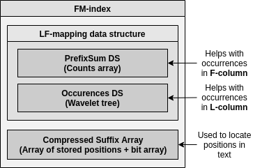
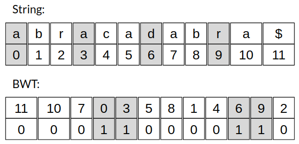
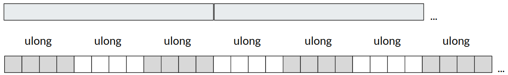
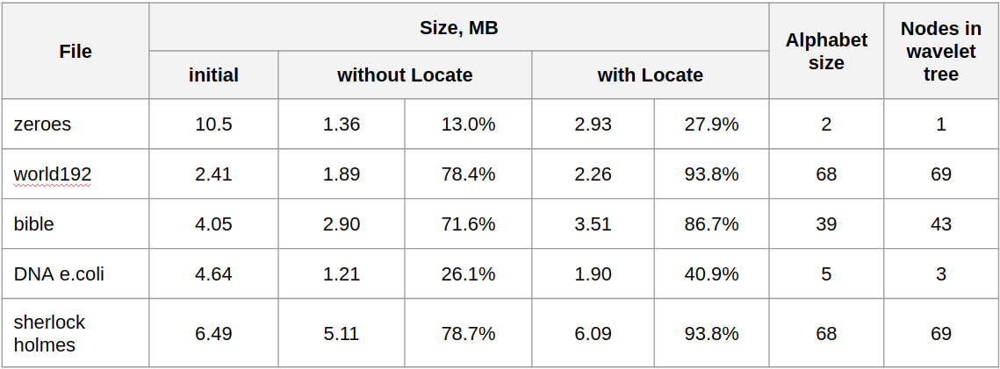
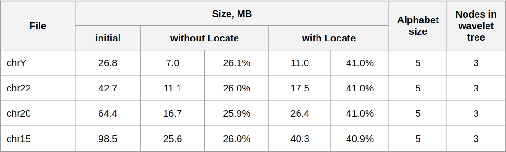

# fm-index

FM-index implementation based on wavelet tree.

The program takes an input text, processes it and answers following queries (P - pattern):
* **Count(P)** - find the **number** of occurrences in O(P)
* **Locate(P)** - find **positions** of occurrences in O(P) + O(k), where k - number of occurrences

The constants in the time complexity estimate depend on alphabet size and factors chosen in the implemented data structures, it's a trade off between time and space.

## Implementation

FM-index consists of _PrefixSum_, _Occurrences_ and _Compressed Suffix Array_ data structures.

PrefixSum and Occurrences data structures are used to support LF-mapping operation in Burrows-Wheeler transform.
Compressed Suffix Array is useful when finding positions of occurrences.

**PrefixSum** implementation is simple: just counts array of the size of the alphabet.
 
**Occurrences** data structure is implemented as a **wavelet tree**.

**Compressed Suffix Array** stores only subset of suffix array entries (every k-th) and also maintains a **bit array** which signifies what entries of BWT have direct mappings. LF-mapping allows to go backwards in text if for some particular entry direct mapping is not stored.

**Bit Array** that is used in wavelet tree and compressed suffix array implementations consists of _ulong_ array for storing bits and auxiliary array where prefix sum information is kept.
This data structure supports **Rank(prefixLen)** operation in O(1) and also answers whether k-th bit is set. See a conceptual diagram below.

 

Also some notes on the implementation:
* The smaller the alphabet, the smaller the space occupancy
* Case-insensitive search, both text and pattern converted to lowercase
* Text and pattern are converted to the derived alphabet
* In Locate operation we examine all alphabet characters to determine char for LF-mapping operation
* Wavelet tree node with alphabet range 2 or smaller is a leaf
* Wavelet tree node with anchor character has alphabet range 3

## Some results

Here are some compression results obtained on different inputs. "Without Locate" case doesn't contain compressed suffix array and thus supports only _Count(P)_ operation.
Easy to see that the best results are achieved on DNA sequences because the alphabet is small. Results are similar for DNA of human chromosomes Y, 15, 20, 22.

